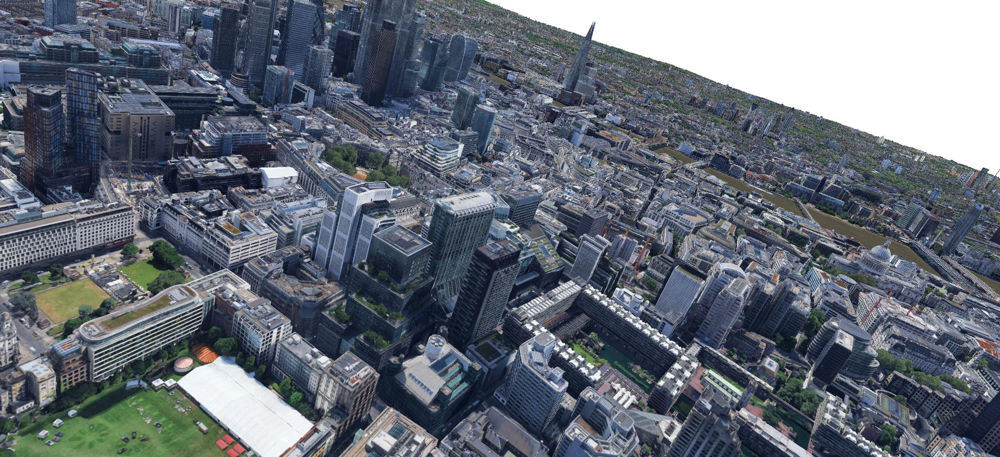
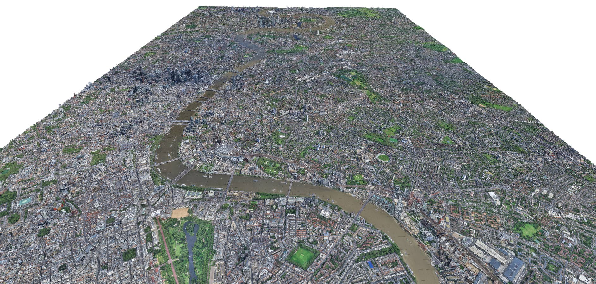

## 使用renderdoc爬取任意范围的高精度地图倾斜摄影模型

### 安装
```
conda create -n mapscraper python=3.9
conda activate mapscraper
git clone https://github.com/Jeremyfff/MapScraper.git
cd MapScraper
pip install -r requirements.txt
```
主要功能: 
 - scraper.py 自动爬取指定经纬度范围的Google Earth数据
 - parse_rdc.py 解析单个rdc文件
 - parse_rdcs.py 解析文件夹中的rdc并自动拼接去重
部分代码受Maps Models Importer项目启发(https://github.com/eliemichel/MapsModelsImporter)

仅供学习renderdoc技术使用，严禁商用

### 成果截图


